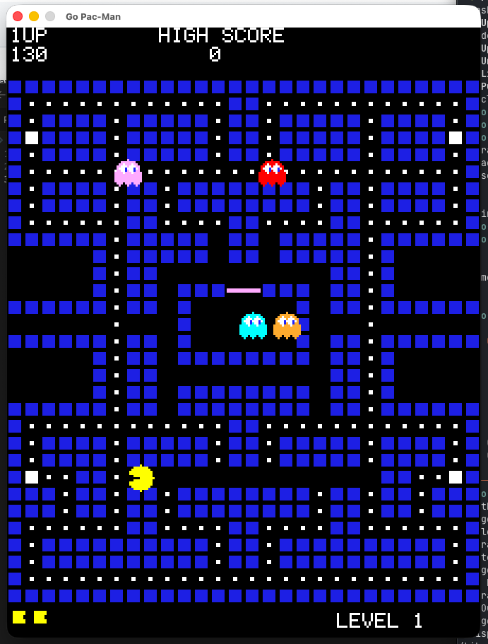

# Go Pac-Man

A classic Pac-Man clone built in Go using [Ebitengine](https://ebitengine.org/). All sprites, sounds, and fonts are generated programmatically — no external assets required.



## Implementation notes
Game was made for testing [obra/superpowers](https://github.com/obra/superpowers) in Claude Code.  Except for 
input and slight guiding during the brainstorming part of superpowers, I left all planning and execution up 
to Claude (just accepting any suggestions).

I'm on the small `Pro-plan` and quickly ran out of tokens and reached my quota and limits.  After brainstorm, planning and implementing
2 of 14 steps I had to wait 5 hours for quota reset.

After implementing step 13 of 14 I hit a new limit
and I had to wait 2 days to continue (sic).

So the project took two days to complete on `Pro-plan`, but the actual time spent with the agent was probably around 1 hour.

## How to Run

```bash
go run main.go
```

Press **Space** to start. Use **arrow keys** or **WASD** to move Pac-Man.

## Gameplay

- Eat all dots to clear the level
- Power pellets turn ghosts blue — eat them for bonus points (200, 400, 800, 1600)
- Ghosts cycle between scatter and chase modes
- Difficulty increases each level (faster ghosts, shorter frightened duration)
- Extra life awarded at 10,000 points

## Documentation

- [Design Document](docs/plans/2026-02-12-go-pacman-design.md) — brainstorming and architecture decisions
- [Implementation Plan](docs/plans/2026-02-12-go-pacman-implementation.md) — 14-task TDD implementation plan

## Development Summary

**14 features implemented across 17 commits:**

- Maze rendering, Pac-Man movement, ghost AI, collision system, sound effects, HUD, game state machine, difficulty scaling, tunnel wrapping, death animation, blinking pellets, extra life

**3 bugs fixed during playtesting:**

1. Ghosts re-entering ghost house through the door (blocked ghost door/house tiles for active ghosts)
2. Ghosts stuck in place due to float64 tile center oscillation (added `lastDecisionTile` tracking)
3. PacMan not responding to input when stopped (allow re-processing tile center when `Dir == DirNone`)

**27 tests passing**, all programmatic (no external assets).
